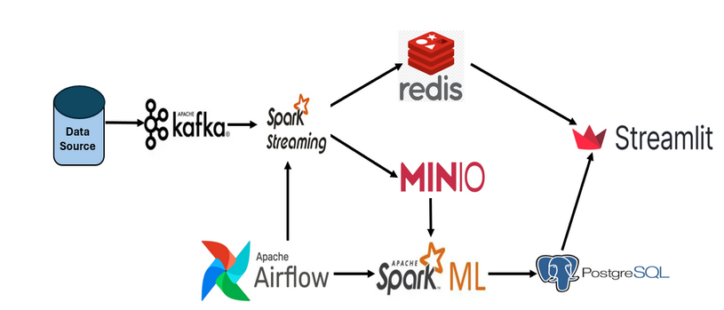

# Hệ thống Phân tích & Dự báo Thời tiết Big Data (Weather Analysis System)

Đây là đồ án xây dựng hệ thống Big Data xử lý dữ liệu thời tiết theo kiến trúc **Lambda Architecture**, kết hợp xử lý luồng thời gian thực (Real-time Streaming) và xử lý lô (Batch Processing) để đưa ra dự báo chính xác.

Hệ thống được triển khai hoàn toàn trên nền tảng **Kubernetes**.

---
## Architecture:

## Thành viên thực hiện (Team Members)

* **Nguyễn Việt Cường** - 20224831
* **Trịnh Việt Cường** - 20224941
* **Nguyễn Danh Gia Minh** - 20224879
* **Hoàng Anh Quyền** - 20224893
* **Lê Minh Tú** - 20215657

---

## 🏗️ Kiến trúc Hệ thống (System Architecture)

Hệ thống tuân thủ mô hình **Lambda Architecture** với 3 lớp chính:

1.  **Speed Layer (Lớp Tốc độ):**
    * Dữ liệu từ Kafka -> Spark Structured Streaming -> Redis -> Dashboard.
    * Mục tiêu: Hiển thị chỉ số thời tiết hiện tại với độ trễ thấp nhất.

2.  **Batch Layer (Lớp Xử lý Lô):**
    * Dữ liệu từ Kafka -> Spark Streaming -> MinIO (Data Lake) -> Spark ML (Airflow Trigger) -> PostgreSQL.
    * Mục tiêu: Lưu trữ dài hạn và huấn luyện mô hình Machine Learning để dự báo tương lai.

3.  **Serving Layer (Lớp Phục vụ):**
    * Streamlit App: Tổng hợp dữ liệu từ Redis (Real-time) và PostgreSQL (Forecast) để hiển thị biểu đồ trực quan.

## 🛠️ Công nghệ sử dụng (Tech Stack)

* **Ingestion:** Apache Kafka (Strimzi/Bitnami).
* **Processing:** Apache Spark (PySpark), Spark MLlib.
* **Orchestration:** Apache Airflow.
* **Storage:** MinIO (S3 Compatible), PostgreSQL, Redis.
* **Visualization:** Streamlit.
* **Infrastructure:** Docker, Kubernetes (Minikube).

---

## 📂 Cấu trúc dự án

.
├── airflow/                # Mã nguồn & DAGs cho Apache Airflow
├── app/                    # Ứng dụng Dashboard (Streamlit)
├── connectors/             # Các module kết nối database (Redis, Postgres)
├── deploy/                 # File cấu hình Kubernetes (YAML)
├── job/                    # Mã nguồn Spark (Streaming & Batch ML)
├── spark/                  # Config và logic lõi của Spark
├── weather_producer.py     # Script giả lập dữ liệu gửi vào Kafka
├── requirements.txt        # Các thư viện Python cần thiết
└── README.md               # File tài liệu này

---

## 🚀 Hướng dẫn Vận hành (Quick Start)

### 1. Khởi động Hạ tầng
Yêu cầu máy đã cài Minikube và kubectl.

cd deploy
kubectl apply -f .

### 2. Đẩy Code lên Airflow
Sử dụng script để đồng bộ code từ máy local lên Pod Scheduler.

SCHEDULER_POD=#(kubectl get pods -n airflow -l component=scheduler -o jsonpath='{.items[0].metadata.name}')
kubectl cp airflow/. airflow/#SCHEDULER_POD:/opt/airflow/dags/
kubectl cp job/ airflow/#SCHEDULER_POD:/opt/airflow/dags/job/

### 3. Kích hoạt luồng dữ liệu (Data Generator)
Chạy script Producer ở máy local để giả lập dữ liệu thời tiết gửi lên K8s.

python weather_producer.py

### 4. Truy cập Dashboard
* **Streamlit:** `localhost:8501`
* **Airflow:** `localhost:8080`
* **MinIO:** `localhost:9001`

---

## 🎓 Bài học kinh nghiệm (Lessons Learned)

Dưới đây là các thách thức kỹ thuật nhóm đã gặp phải và giải pháp khắc phục trong quá trình thực hiện đồ án.

### Lesson 1: Data Ingestion & Simulation (Mô phỏng dữ liệu)

* **Vấn đề:** Dữ liệu gốc là file CSV tĩnh, không phù hợp để demo Streaming thời gian thực.
* **Giải pháp:** Xây dựng `weather_producer.py` hoạt động như một Kafka Producer, đọc tuần tự từng dòng CSV, cập nhật timestamp hiện tại và gửi liên tục vào hệ thống.
* **Kết quả:** Tạo được dòng dữ liệu vô hạn, ổn định để kiểm thử tính năng Real-time Dashboard.

### Lesson 2: Handling Cold Start (Xử lý khởi động lạnh)

* **Vấn đề:** Khi hệ thống mới chạy (Cold Start), các tác vụ Feature Engineering (như tạo Lag features 1h, 3h) tạo ra nhiều giá trị NULL. Việc dùng `dropna()` khiến tập train bị rỗng -> Spark Job crash.
* **Giải pháp:** Thay đổi chiến lược xử lý dữ liệu thiếu. Thay vì xóa bỏ, nhóm sử dụng kỹ thuật `Imputation` (điền giá trị 0 hoặc trung bình) cho giai đoạn khởi chạy đầu tiên.
* **Kết quả:** Pipeline ML hoạt động trơn tru ngay cả khi mới thu thập dữ liệu được 5 phút.

### Lesson 3: Spark Schema & Parquet Integration

* **Vấn đề:** Batch Job chạy trước khi Streaming Job kịp ghi file dữ liệu, dẫn đến lỗi `AnalysisException` do Spark không tìm thấy metadata của Parquet.
* **Giải pháp:** Thiết lập Airflow Sensor và logic kiểm tra (Try-Catch) để đảm bảo thư mục dữ liệu tồn tại trước khi Spark ML khởi chạy.

### Lesson 4: System Integration in Kubernetes (Kết nối dịch vụ)

* **Vấn đề:** Các service (Spark, Redis, Postgres) không thể giao tiếp với nhau khi dùng `localhost` bên trong Pod.
* **Giải pháp:** Chuẩn hóa toàn bộ cấu hình trong `config.py`, sử dụng **Kubernetes Service Name** (VD: `weather-redis`, `weather-minio`) làm địa chỉ kết nối nội bộ.
* **Kết quả:** Hệ thống giao tiếp ổn định, không phụ thuộc vào IP động của Pod.

### Lesson 5: Airflow Deployment (Triển khai liên tục)

* **Vấn đề:** Code sửa xong nhưng Airflow không cập nhật, quy trình build lại Docker Image tốn quá nhiều thời gian.
* **Giải pháp:** Áp dụng cơ chế **Hot-swapping** bằng lệnh `kubectl cp` kết hợp với restart Pod Scheduler, giúp giảm thời gian deploy code từ 10 phút xuống còn 30 giây.

---
